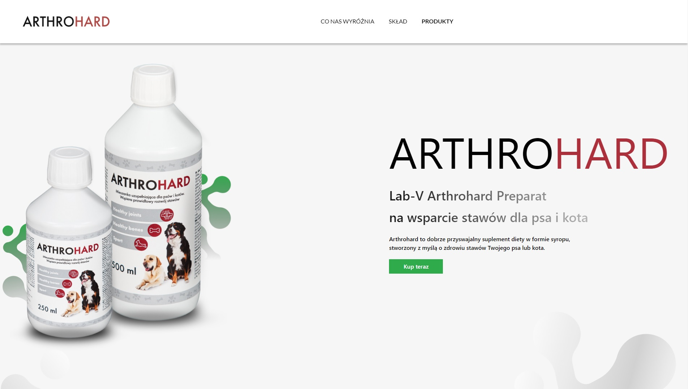
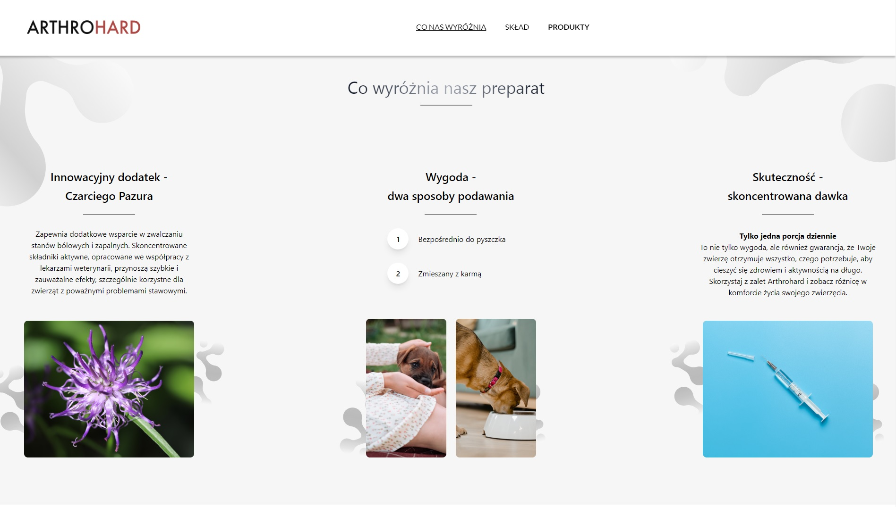
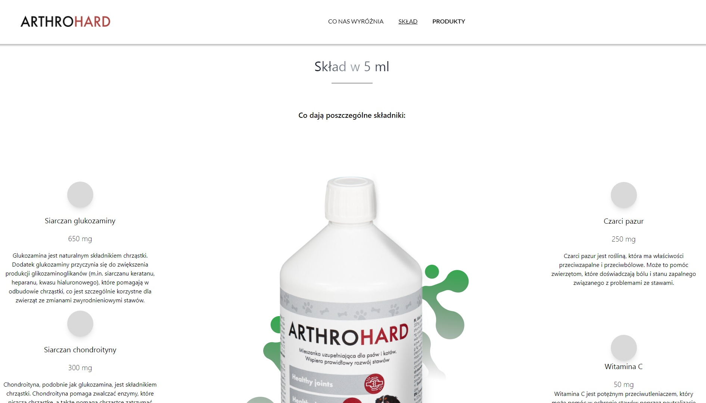
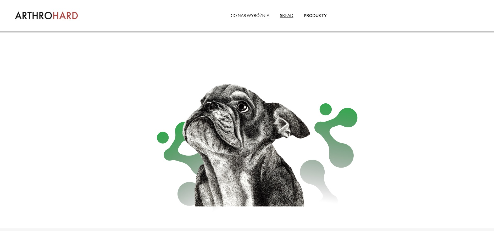
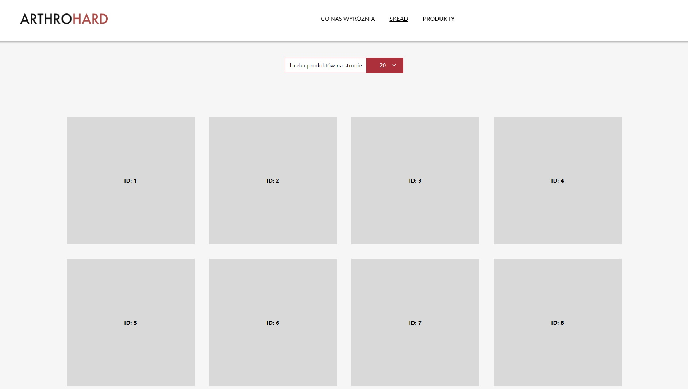

# Arthrohard

 

 

## :scroll: Project description

An online shop application (SPA) with products fetched via the API. In the project I used the VUE3 framework, the components were styled using Tailwind CSS and axios is responsible for retrieving data from the API. The website is responsive, has a background with parallax effect and the possibility to load data dynamically (on scroll mouse)

http://arthrohardpawelburakowski.pl/

## :hammer_and_pick: Built With

- JavaScript
- VUE3
- API
- HTML
- CSS
- Tailwind CSS

 

 

## :gear: Installation
1. git clone
2. cd repo
3. npm i
4. npm run dev

